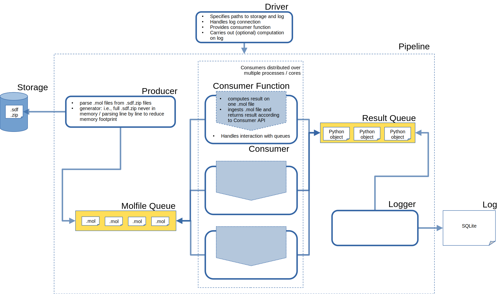

# Architecture




## Consumer API
Below you find a minimal example of how to write a consumer function.

```Python
from sdf_pipeline import utils

molfile = (
        "https://en.wikipedia.org/wiki/This_Is_Water\n\n\n  0  0  0     0  0            999 V3000\n"
        "M  V30 BEGIN CTAB\n"
        "M  V30 COUNTS 3 2 0 0 0\n"
        "M  V30 BEGIN ATOM\n"
        "M  V30 1 H 0 0 0 0\n"
        "M  V30 2 O 0 0 0 0\n"
        "M  V30 3 H 0 0 0 0\n"
        "M  V30 END ATOM\n"
        "M  V30 BEGIN BOND\n"
        "M  V30 1 1 1 2\n"
        "M  V30 2 1 3 2\n"
        "M  V30 END BOND\n"
        "M  V30 END CTAB\n"
        "M  END"
    )

def get_molfile_id(molfile: str) -> str:
    return molfile.splitlines()[0].strip()

def molfile_length_consumer(molfile: str, get_molfile_id: Callable) -> utils.ConsumerResult:
    return utils.ConsumerResult(
        "molfile length",
        utils.get_current_time(),
        get_molfile_id(molfile),
        str(len(molfile)),
    )
```

The [tests](tests/test_drivers.py) show how to pass a consumer function to the pipeline via the drivers.
Run the tests with

```Shell
pytest tests/test_drivers.py -s
```

